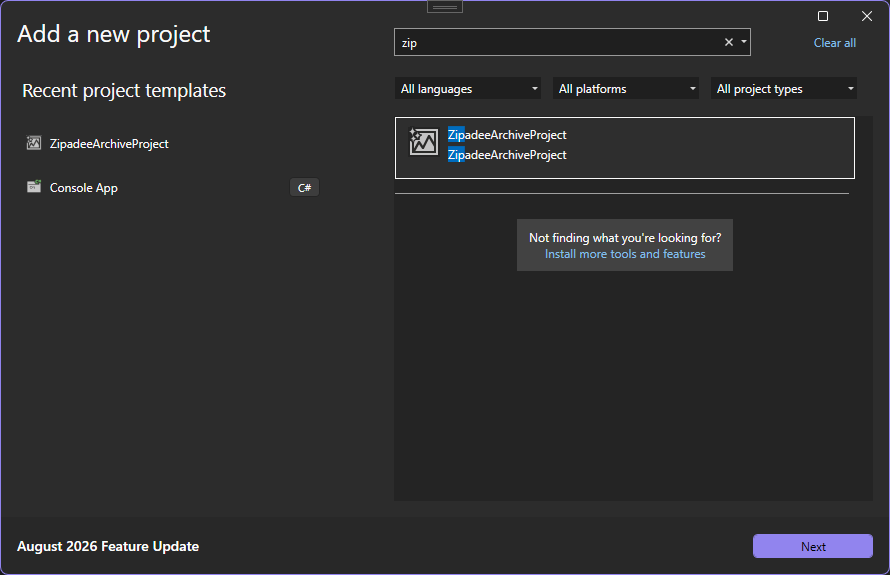
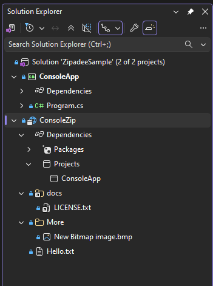
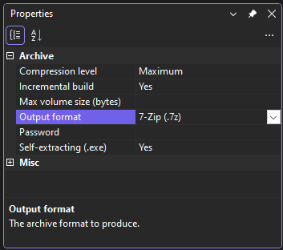
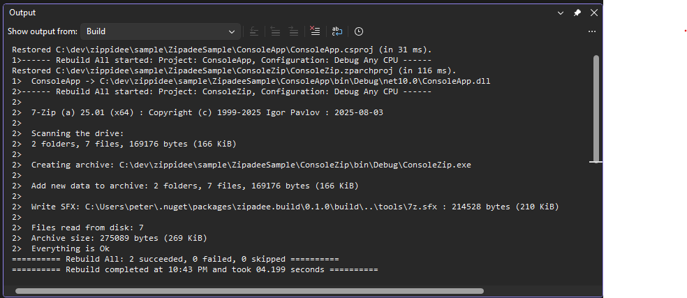

<!--
  This is the Visual Studio Marketplace listing page for Zipadee, referenced by
  publishManifest.json's "overview" field. See VsixPublisher's "assetFiles" in
  publishManifest.json for how the images/ referenced below get uploaded
  alongside this file.

  The icon below is the one exception to that - it's a raw  tag (needed for
  width/height/align, which Markdown's  syntax can't express), and confirmed
  empirically that the Marketplace's overview renderer only rewrites relative paths to
  the gallery CDN for  syntax, not raw HTML : the other four images
  below (all ) resolved correctly, this one 404'd against marketplace.visualstudio.com's
  own domain instead. Pointed at a stable absolute GitHub URL instead of a relative path,
  so it doesn't depend on the Marketplace's asset-copying at all.
-->


# Zipadee

Zipadee adds a **Zipadee Archive Project** type to Visual Studio: a project whose "build output" is an archive file (zip, 7z, tar, cab, or a self-extracting .exe) assembled from the files, linked files, and other projects' build outputs you add to it.

Think of it as a lightweight, in-solution alternative to a separate packaging script - add a Zipadee project alongside the rest of your solution, add the files and project references you want bundled, and every build produces an up-to-date archive.

## Features

- **Files, links, and project outputs** — add existing files directly, link to files elsewhere on disk, or reference another project in the solution and pull in its build output (with correct build ordering, for free, via standard MSBuild project references).
- **Multiple archive formats** — Zip, 7-Zip (.7z), Tar, gzip-compressed tar (.tar.gz), Windows Cabinet (.cab), and RAR (.rar). None of the underlying tools are bundled with Zipadee itself - see Getting started below for what each format needs installed.
- **Configurable compression** — from Store (no compression) through Ultra.
- **Password protection** — AES-256 encryption for the Zip, 7-Zip, and RAR formats, with header encryption (hides filenames too) applied automatically. The password lives in your local `.user` file, never in the shared project file.
- **Self-extracting archives** — produce a self-extracting `.exe` (7-Zip format) that needs no archive tool to open.
- **Incremental builds** — the archive is only rebuilt when its contents actually change, not on every build. Can be turned off per-project to force a fresh archive every time.
- **Multi-volume archives** — split the output into multiple numbered files of a set maximum size, for the Zip, 7-Zip, RAR, and Cab formats.
- **Filter project reference output** — exclude files (by wildcard pattern or exact name) from a referenced project's output, with an override to force specific files back in.
- **Customizable archive file name** — compose the output file name from `{ProjectName}`/`{Version}`/`{Date}`/`{Time}` tokens.
- Works with `dotnet build` / `dotnet restore` on the command line and in CI, not just inside Visual Studio.

## Getting started

1. Install whatever external tool your chosen format needs - none of them are bundled, and both are expected on `PATH` (neither installer adds itself there automatically - a manual step after installing):
   - `Zip`, `SevenZip`, `Tar`, `GZip` — [7-Zip](https://www.7-zip.org/)'s command-line tool (`7z`).
   - `Rar` — [WinRAR](https://www.rarlab.com/download.htm)'s command-line tool (`rar`).
   - `Cab` — nothing extra; uses `makecab.exe`, built into every Windows install.
2. Install this extension.
3. In Visual Studio, choose **File > New > Project** and search for **Zipadee Archive Project**.
4. Add files via **Add > Existing Item** (or **Add as Link** for files outside the project folder), or add a **Project Reference** to another project in your solution to pull in its build output.
5. Build. The archive appears alongside the project's other build output.

Archive settings (format, compression level, password, self-extracting) are set as MSBuild properties in the project file - see [Project file reference](#project-file-reference) below for the full list.

Start from **File > New > Project** and search for "Zip" or "Zipadee" - the **Zipadee Archive Project** template shows up alongside any other installed template. Give it a name and location like any other project; it's added to the solution as its own project, not a folder inside an existing one.



Once created, the archive project sits in Solution Explorer next to the projects it packages. Add a **Project Reference** to pull in another project's build output - here `ConsoleZip` references `ConsoleApp`, shown under **Dependencies > Projects** - and it's rebuilt first, with its output added to the archive automatically. Existing files (`Hello.txt`) and linked files from elsewhere on disk (`docs\LICENSE.txt`) show up as ordinary content alongside it.

 

Select the project node and open the **Properties** window (F4, or **View > Properties Window**) to configure the archive itself - format, compression level, password, self-extracting output, and volume size all live under the **Archive** category shown here. The same settings are also available on the project's General property page; either way, changes are written straight to the `.zparchproj` file (or its `.user` file, for the password).



Build the solution as usual - **Build > Build Solution**, or `dotnet build` - and the archive project builds like any other: referenced projects first, then the archive tool itself, visible in the **Output** window. The finished archive lands alongside the project's other build output (`bin\Debug\`, here), ready to ship.



## Project file reference

All archive settings are plain MSBuild properties. You can set them either from Visual Studio - select the project node and use the **Properties** window (F4), or the **General** page of the project's **Properties** - or by editing the `.zparchproj` file directly. The password is the one exception to where it gets saved: it goes to a `.zparchproj.user` file rather than the project file (see below), whichever way you set it.

| Property | Values | Default | Notes |
|---|---|---|---|
| `ZipadeeOutputFormat` | `Zip`, `SevenZip`, `Tar`, `GZip`, `Cab`, `Rar` | `Zip` | `Zip`/`SevenZip`/`Tar`/`GZip` need 7-Zip's command-line tool on `PATH`; `Rar` needs WinRAR's `rar` on `PATH` too - see Getting started above. None of them are bundled. `GZip` produces a `.tar.gz` (tar, then gzip-compressed) since gzip alone can't hold more than one file. `Cab` produces a Windows Cabinet using the `makecab.exe` built into every Windows install - nothing extra needed - see [Cab files and DDF support](#cab-files-and-ddf-support) below. |
| `ZipadeeCompressionLevel` | `Store`, `Fastest`, `Fast`, `Normal`, `Maximum`, `Ultra` | `Normal` | One generic scale across every format - each maps it to its own native settings differently. See [Compression level mapping](#compression-level-mapping) below. Ignored for `Tar` (tar itself doesn't compress). |
| `ZipadeeCreateSfx` | `true`, `false` | `false` | Produces a self-extracting `.exe` instead of a plain archive (console-style extraction, since 7-Zip's default SFX module is used). **Only valid with `ZipadeeOutputFormat=SevenZip`** - 7-Zip's SFX modules can't self-extract any other format, and the build fails with a clear error if combined with one. |
| `ZipadeePassword` | any string | *(none)* | AES-256 password protection. **Only valid with `Zip`, `SevenZip`, or `Rar`** - Tar, GZip, and Cab have no encryption support, and the build fails if combined with one. Filenames are also encrypted automatically whenever a password is set (7-Zip's `-mhe=on`, or RAR's `-hp`, which does this as part of the same switch that sets the password). |
| `ZipadeeIncrementalBuild` | `true`, `false` | `true` | Skip re-archiving when nothing changed. Set to `false` to force a fresh archive on every build. |
| `ZipadeeMaxVolumeSize` | a positive integer (bytes) | *(none, single file)* | Splits the archive into multiple numbered volumes of at most this many bytes each. **Valid for `Zip`, `SevenZip`, `Rar`, and `Cab`** - ignored (with a warning) for `Tar`/`GZip`, since neither format supports it. **Not valid combined with `ZipadeeCreateSfx`** - a self-extracting archive can't also be split, and the build fails with a clear error if both are set. For `Cab` specifically, the value **must be a multiple of 512** (`makecab.exe`'s own cluster-size requirement); see [Cab files and DDF support](#cab-files-and-ddf-support) below for how it interacts with a custom DDF. See [Multi-volume archives](#multi-volume-archives) below for per-format output naming and the incremental-build caveat. |
| `ZipadeeProjectOutputExclude` | `;`-separated wildcard patterns (`*.pdb`) or exact file names | *(none)* | Leaves matching files out of a referenced project's output - see [Filtering project reference output](#filtering-project-reference-output) below. Doesn't affect the project's own `Content`/`None` items, which already have full control via the item type itself. |
| `ZipadeeProjectOutputInclude` | `;`-separated wildcard patterns or exact file names | *(none)* | Overrides `ZipadeeProjectOutputExclude`, forcing matching files back in. Has no effect (with a warning) without `ZipadeeProjectOutputExclude` also set. |
| `ZipadeeArchiveFileName` | text with `{ProjectName}`/`{Version}`/`{Date}`/`{Time}` tokens | `{ProjectName}` | The archive's output file name (without extension) - see [Customizing the archive file name](#customizing-the-archive-file-name) below. **Ignored entirely if `ZipadeeArchiveOutputPath` is also set** (a warning is logged). |
| `ZipadeeArchiveDateFormat` | a .NET date format string | `yyyyMMdd` | The format substituted wherever `{Date}` appears in `ZipadeeArchiveFileName`. Can't contain a character Windows disallows in file names (`< > : " / \ \| ? *`) - the build fails with a clear error if it does. |
| `ZipadeeArchiveTimeFormat` | a .NET time format string | `HHmmss` | The format substituted wherever `{Time}` appears in `ZipadeeArchiveFileName`. Same character restriction as `ZipadeeArchiveDateFormat` above. |

### Where to put the items being archived

Add files as `Content` items (Solution Explorer's **Add > Existing Item** uses `Content` for this project type) - only `Content` items are archived. `None` items are deliberately left out, so the project file can hold a file it doesn't want in the archive itself - a settings-only DDF for the `Cab` format (see below) being the main example - without it silently ending up in the output:

```xml
<ItemGroup>
  <Content Include="readme.txt" />
</ItemGroup>
```

Link to a file that lives outside the project folder (Solution Explorer's **Add > Existing Item > Add as Link**) with `%Link%` metadata - it's archived at the link path, not its on-disk path:

```xml
<ItemGroup>
  <Content Include="..\shared\LICENSE.txt" Link="docs\LICENSE.txt" />
</ItemGroup>
```

Link in a *whole folder* from outside the project by combining a wildcard `Include` with `%(RecursiveDir)` in `Link` - every file under it, including subfolders, is archived preserving that folder's structure. There's no dedicated "add folder as link" command in Solution Explorer for this - add the `ItemGroup` by editing the `.zparchproj` file directly:

```xml
<ItemGroup>
  <Content Include="..\shared-assets\**\*.*">
    <Link>assets\%(RecursiveDir)%(Filename)%(Extension)</Link>
  </Content>
</ItemGroup>
```

Pull in another project's build output with a normal `ProjectReference` - the referenced project is built first, and its output (including the compiled assembly, for a runnable apphost-style `.exe`) is archived at the root of the archive:

```xml
<ItemGroup>
  <ProjectReference Include="..\ConsoleApp\ConsoleApp.csproj" />
</ItemGroup>
```

### Filtering project reference output

By default every file a `ProjectReference` copies to its output directory is archived - the compiled assembly, its `.deps.json`/`.runtimeconfig.json`/apphost `.exe`, and any of the referenced project's own `Content`/`None` items marked `CopyToOutputDirectory`. `ZipadeeProjectOutputExclude` leaves matching files out instead, by a `;`-separated list of wildcard patterns (`*`/`?`) or exact file names, matched against each file's archive-relative name:

```xml
<PropertyGroup>
  <ZipadeeProjectOutputExclude>*.pdb;ThirdParty.dll</ZipadeeProjectOutputExclude>
</PropertyGroup>
```

`ZipadeeProjectOutputInclude` (same pattern syntax) forces specific files back in even if `ZipadeeProjectOutputExclude` would otherwise drop them - an override, not an additional filter both have to satisfy:

```xml
<PropertyGroup>
  <ZipadeeProjectOutputExclude>*.dll</ZipadeeProjectOutputExclude>
  <ZipadeeProjectOutputInclude>ThirdParty.dll</ZipadeeProjectOutputInclude>
</PropertyGroup>
```

A pattern can't contain `\` - it matches by file name or extension, not by folder. This is purely a filter over whatever already reaches the archive via the mechanism above; it doesn't pull in anything new. Notably, a companion `.pdb` or XML doc-comment file **isn't currently part of that set** for this project type (they're placed directly by the compiler, bypassing the copy-to-output-directory protocol these properties filter), so a `*.pdb` pattern has nothing to match yet.

See `sample/ZipadeeSample/ConsoleZip` in the repo for a real, working example - it excludes a `build-info.txt` that `ConsoleApp` copies to its own output.

### Customizing the archive file name

By default the archive's file name is just the project name (e.g. `MyArchive.zip`). `ZipadeeArchiveFileName` composes a different one from four tokens, substituted literally wherever they appear:

| Token | Substituted with |
|---|---|
| `{ProjectName}` | `$(MSBuildProjectName)` - the default on its own |
| `{Version}` | `$(Version)` (defaults to `1.0.0` via the SDK if not set on the project) |
| `{Date}` | today's date, formatted with `ZipadeeArchiveDateFormat` (default `yyyyMMdd`) |
| `{Time}` | the current time, formatted with `ZipadeeArchiveTimeFormat` (default `HHmmss`) |

```xml
<PropertyGroup>
  <ZipadeeArchiveFileName>{ProjectName}-{Version}-{Date}</ZipadeeArchiveFileName>
</PropertyGroup>
```

produces `MyArchive-1.2.0-20260901.zip`. The date/time format is a separate property rather than an inline `{Date:yyyyMMdd}`-style syntax, so every `{Date}` (or `{Time}`) in the name shares one format - set `ZipadeeArchiveDateFormat`/`ZipadeeArchiveTimeFormat` to any .NET date/time format string, as long as it doesn't contain a character Windows disallows in file names (a stray `:` from something like `HH:mm:ss` is the most likely mistake - the build fails with a clear error rather than trying to write to an invalid path).

This only controls the file name - for full control over the entire output path (including its directory), set `ZipadeeArchiveOutputPath` directly instead; doing so ignores `ZipadeeArchiveFileName` entirely (with a warning if both are set).

See `sample/ZipadeeSample/ConsoleGZip` in the repo for a real, working example using `{Date}`.

### Setting the password

Since a password must never end up committed to source control, it isn't stored in the `.zparchproj` file itself. Setting it in the **Properties** window handles this for you - Visual Studio writes it to a `<ProjectFileName>.zparchproj.user` file alongside the project, which the standard Visual Studio `.gitignore` template already excludes.

To set it by hand instead, create that `.user` file yourself:

```xml
<Project>
  <PropertyGroup>
    <ZipadeePassword>YourPasswordHere</ZipadeePassword>
  </PropertyGroup>
</Project>
```

### Compression level mapping

`ZipadeeCompressionLevel` is one generic 6-level scale shared across every format - it exists because none of the underlying tools agree with each other: 7-Zip has a sparse 0/1/3/5/7/9 scale, RAR a clean 0-5 range, and Cab only has two compression methods at all (MSZIP and LZX), with LZX taking a separate memory/dictionary-size setting rather than a level. `ZipadeeCompressionLevel` maps onto whichever of those the selected `ZipadeeOutputFormat` actually uses:

| Level | Zip / SevenZip / GZip (7-Zip `-mx=`) | Rar (`-m`) | Cab |
|---|---|---|---|
| `Store` | 0 (no compression) | 0 (no compression) | `Compress=off` (no compression) |
| `Fastest` | 1 | 1 | MSZIP |
| `Fast` | 3 | 2 | MSZIP |
| `Normal` | 5 | 3 | LZX, `CompressionMemory=15` |
| `Maximum` | 7 | 4 | LZX, `CompressionMemory=18` |
| `Ultra` | 9 | 5 | LZX, `CompressionMemory=21` |

Ignored entirely for `Tar` - tar itself doesn't compress, and `GZip`'s tar step ahead of the actual gzip compression doesn't use it either (only the gzip step does, at the 7-Zip `-mx=` values above).

### Cab files and DDF support

`ZipadeeOutputFormat=Cab` produces a Windows Cabinet using `makecab.exe`, which ships with every Windows install - nothing extra to install, unlike `Rar`. Cab has two hard format limitations: no encryption support at all (a password fails the build, same as `Tar`/`GZip`), and no self-extracting option.

With no further settings, Zipadee generates the whole DDF itself - the file list comes from the project's `Content` items, the same as every other format. For anything makecab supports beyond what Zipadee's own settings expose (for example `MaxDiskSize` for a multi-disk cabinet), add a DDF file **next to the project file, with the same base name** (a project called `MyArchive.zparchproj` looks for `MyArchive.ddf`) containing only `.Set` directives - **no file list**. If found, the build appends its own computed settings first (so yours can override them), then its own mandatory settings last, then the file list itself, generated automatically from the project's `Content` items - you don't list files in this DDF, only settings:

```
; MyArchive.ddf
.Set MaxDiskSize=0
```

This file is always excluded from the cab's own contents, even if it's also added to the project as a `Content` item (e.g. so it shows up in Solution Explorer) - unlike every other format, where a file with this same name is just an ordinary file and follows the normal Content/None rule above.

If `ZipadeeMaxVolumeSize` is also set, it always wins over a `MaxDiskSize` directive in your own DDF - a warning is logged so the override isn't a silent surprise. Leave `MaxDiskSize` out of the DDF entirely if you're using `ZipadeeMaxVolumeSize`, or vice versa.

See `sample/ZipadeeSample/ConsoleCab` in the repo for a real, working example, including a DDF listing every documented `makecab.exe` directive.

### Multi-volume archives

Setting `ZipadeeMaxVolumeSize` splits the archive into multiple numbered files instead of one, once the content exceeds that size. Each format names its volumes differently - this is native tool behavior, not something Zipadee can normalize:

| Format | Volume naming |
|---|---|
| `Zip` / `SevenZip` | `MyArchive.zip.001`, `MyArchive.zip.002`, ... (numbering appended after the extension) |
| `Rar` | `MyArchive.part1.rar`, `MyArchive.part2.rar`, ... (numbering embedded before the extension) |
| `Cab` | `MyArchive1.cab`, `MyArchive2.cab`, ... |

A few things worth knowing:

- **Not valid with `ZipadeeCreateSfx`.** 7-Zip's self-extracting modules don't support split archives - the build fails with a clear error rather than silently producing a broken `.exe`.
- **Ignored for `Tar`/`GZip`**, with a warning - neither format has a native volume-splitting mechanism.
- **`Cab` needs a multiple of 512** - `makecab.exe`'s own cluster-size requirement. A non-multiple fails the build with a clear error before `makecab.exe` gets a chance to reject it with a less obvious one.
- **Interacts with incremental builds**: since the number of volumes produced depends on the content, not just whether it changed, Zipadee can't precisely track staleness across a volume count change - the archive is always rebuilt when `ZipadeeMaxVolumeSize` is set, regardless of `ZipadeeIncrementalBuild` (a warning is logged). Stale volumes left over from a previous build with a different `ZipadeeMaxVolumeSize` (or different content) are cleaned up automatically before each build, so you never end up with an extra leftover volume from an earlier run.

See `sample/ZipadeeSample/ConsoleVolumes` in the repo for a real, working example that produces two `.zip` volumes.

### Full example

A project that produces a password-protected, self-extracting 7-Zip archive at maximum compression, containing a content file, a linked file, and another project's build output:

```xml
<Project Sdk="Microsoft.Build.NoTargets/3.7.0">
  <PropertyGroup>
    <TargetFramework>net10.0</TargetFramework>
    <ZipadeeOutputFormat>SevenZip</ZipadeeOutputFormat>
    <ZipadeeCompressionLevel>Maximum</ZipadeeCompressionLevel>
    <ZipadeeCreateSfx>true</ZipadeeCreateSfx>
  </PropertyGroup>
  <ItemGroup>
    <PackageReference Include="Zipadee.Build" Version="0.1.3" />
  </ItemGroup>
  <ItemGroup>
    <Content Include="Hello.txt" />
    <Content Include="..\shared\LICENSE.txt" Link="docs\LICENSE.txt" />
  </ItemGroup>
  <ItemGroup>
    <ProjectReference Include="..\ConsoleApp\ConsoleApp.csproj" />
  </ItemGroup>
</Project>
```

with a `ConsoleZip.zparchproj.user` file alongside it setting `ZipadeePassword`, as shown above.

## License

Zipadee is licensed under [GPL-3.0](https://github.com/Jonesie/zipadee/blob/main/LICENSE). It shells out to 7-Zip (LGPL / BSD 3-clause / BSD 2-clause) to perform the actual archiving - not bundled, see Getting started above.

<a href="https://www.buymeacoffee.com/jonesie" target="_blank"></a>

## Feedback

Found a bug or have a feature request? [Open an issue](https://github.com/Jonesie/zipadee/issues) on GitHub.
